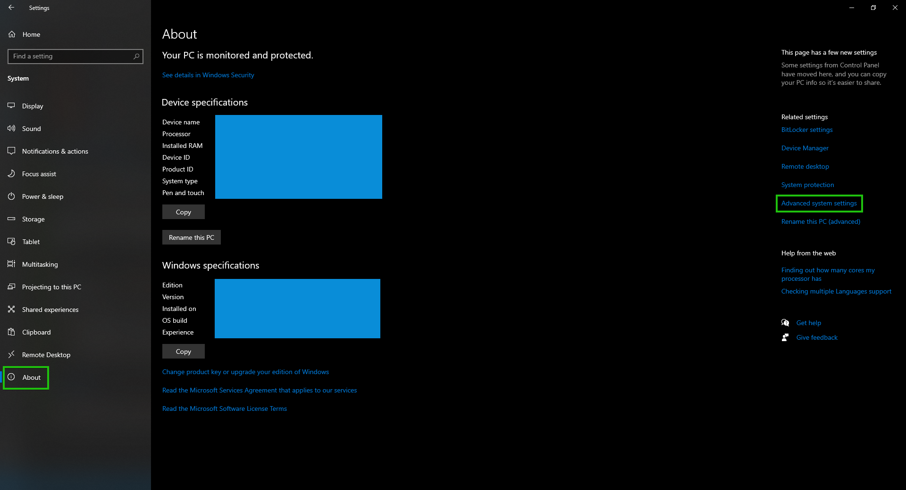

import Tabs from "@theme/Tabs";
import TabItem from "@theme/TabItem";
import Quiz from "@site/src/components/quiz";

# Command Line

:::tip
Harap membaca [Pengantar Command Line](introduction) jika kamu belum membacanya.
:::

:::info
Apabila kamu mencari materi untuk macOS, materi tersebut [ada di sini](mac).
:::

Materi ini ditujukan untuk mengajarkan kamu untuk menggunakan _command line_ dalam melakukan berbagai macam tugas. Materi akan berbentuk tutorial dengan penjelasan. Kamu diharapkan untuk membaca penjelasan, tidak hanya _copy-paste_ perintah-perintah yang ada.

:::warning Dokumen ini menggunakan PowerShell

Windows memiliki dua _shell_, yaitu Command Prompt dan PowerShell. Sebelum melanjutkan, harap ketahui shell yang digunakan adalah **PowerShell**, bukan Command Prompt.

Apabila kamu menggunakan Visual Studio Code, kamu [dapat mengganti _shell_-nya](https://stackoverflow.com/a/45899693).

Apabila kamu tidak menggunakan Windows 11, kamu disarankan untuk [memasang versi PowerShell terbaru](https://learn.microsoft.com/en-us/powershell/scripting/install/installing-powershell).

:::

## Tampilan

Buka shell kalian menggunakan Windows Terminal atau terminal di Visual Studio Code. Kalian akan melihat baris yang terlihat seperti berikut:

```
PS C:\Users\User>
```

Setiap kali kalian melihat baris tersebut, artinya _command line_ siap menerima perintah baru. Setiap perintah yang kalian jalankan pada _command line_ akan dieksekusi pada _current working directory_.

:::note Current working directory (cwd)
_Current working directory_ adalah posisi di mana _command line_ kalian berada. Hal ini ditandai dengan path yang terlihat sebelum `>` dalam setiap baris saat ingin melakukan perintah.

```
PS C:\Users\User>
   ^^^^^^^^^^^^^
       CWD
```

Sebagai contoh, pada contoh di atas, _current working directory_-nya adalah `C:\Users\User`. Anggap _current working directory_ ini adalah _file explorer_ kalian, di mana folder tersebut sedang dibuka.
:::

:::info
Mulai titik ini, semua _current working directory_ akan disingkat menjadi `cwd`.
:::

## Command Line Dan Folder

Seperti halnya dengan _file explorer_, kamu bisa melakukan banyak hal. Cetak semua isi folder kalian menggunakan perintah `dir`.

```
PS C:\Users\Public> dir

Directory: C:\Users\Public

Mode                 LastWriteTime         Length Name
----                 -------------         ------ ----
d-r--          12/15/2022 11:19 PM                Documents
d-r--           12/7/2019  4:14 PM                Downloads
d-r--           12/7/2019  4:14 PM                Music
d-r--           12/7/2019  4:14 PM                Pictures
d-r--           12/7/2019  4:14 PM                Videos
```

### Berpindah Folder

Kamu bisa berpindah ke folder lain menggunakan perintah `cd`.

- Untuk berpindah ke folder yang ada di dalam folder cwd, ketik `cd <path_ke_folder>`.
- Untuk berpindah ke folder sebelumnya, ketik `cd ..`

:::tip

`<path_ke_folder>` dapat berupa _relative_ atau _absolute_ path. Apabila kamu lupa mengenai konsep representasi path, klik [di sini](../filesystem#representasi-path) untuk mempelajari kembali.

Kamu juga bisa menggabungkan folder sebelumnya dengan relative path. Sebagai contoh, jika kamu berada di `C:\home\user\halo` dan ingin pindah ke `C:\home\user\keren`, kamu bisa gunakan `cd ..\keren`.

:::

Perhatikan perubahan cwd yang ada dalam ilustrasi berikut.

```
PS C:\Users\Public> cd Downloads
PS C:\Users\Public\Downloads> cd ..
PS C:\Users\Public>
```

<Quiz answers={["D:\\semoga", "D:\\semoga\\lancar", "D:\\lancar", "D:\\lancar\\ya"]} correctAnswer={2}>
  Anggap kondisi command line sedang berada pada <code>D:\</code>. Apabila
  dijalankan perintah berikut, dimanakan command line berada pada akhir command terakhir?
  <pre>

cd semoga
cd ..
cd lancar
cd ya
cd ..

</pre>

</Quiz>

## Interaksi Dengan Program

Dalam menggunakan command line, dipastikan akan ada interaksi dengan program dan perintah-perintah yang ada. Bagian ini akan menjelaskan bagaimana suatu program dijalankan dalam command line.

### Struktur Perintah

Secara umum, struktur perintah adalah

```
<perintah_atau_program> <argumen_1> <argumen_2> ... <argumen_n>
```

Di mana `<perintah_atau_program>` dapat berupa perintah bawaan dari PowerShell, atau program yang berada di salah satu folder `PATH`.

Argumen adalah data-data tambahan yang kamu kirim dalam perintah kamu. Dalam contoh `cd` di atas, argumen digunakan untuk menyatakan folder tujuan. Penggunaan argumen dapat berbeda-beda, tergantung pada perintah atau program yang dipanggil.

Berikut contoh-contoh perintah dan pembagian perintah serta argumennya:

| Baris              | Nama Perintah/Program | Argumen      |
| ------------------ | --------------------- | ------------ |
| `cd folder`        | `cd`                  | `folder`     |
| `echo halo dunia`  | `echo`                | `halo dunia` |
| `mkdir folderbaru` | `mkdir`               | `folderbaru` |

### Perintah Bawaan

Setiap sistem operasi memiliki sejumlah perintah-perintah bawaan yang ada. Untuk Windows, kamu bisa mendapatkan informasi tersebut [di sini](https://learn.microsoft.com/en-us/windows-server/administration/windows-commands/windows-commands). Namun, berikut adalah perintah-perintah yang biasa digunakan:

| Perintah | Fungsi                      | Argumen                                  | Contoh                                                 |
| -------- | --------------------------- | ---------------------------------------- | ------------------------------------------------------ |
| `cd`     | Berpindah ke folder lain    | Path menuju folder tujuan                | `cd folder`                                            |
| `echo`   | Menampilkan pesan           | Pesan yang ingin ditampilkan             | `echo halo`                                            |
| `cat`    | Menampilkan isi dari file   | Path menuju file                         | `cat file.txt`                                         |
| `mkdir`  | Membuat folder baru         | Nama folder                              | `mkdir folder`                                         |
| `ls`     | Menampilkan isi dari folder | Path folder (opsional, _default_ ke cwd) | `ls` (tanpa argumen)<br/> `ls folder` (dengan argumen) |

#### Latihan

Untuk memahami konsep command line sebagai explorer dan interaksi dengan perintah, coba lakukan hal berikut:

1. Buka _shell_ dan _file explorer_ kamu
2. **Pada _file explorer_**, pergi ke `C:\Users\<username_kamu>`
3. Lakukan `ls` pada command line
4. Buat folder baru melalui _file explorer_ bernama `latihanshell`
5. Lakukan `ls` pada command line lagi, apakah kamu bisa menemukan `latihanshell`?
6. Buat folder baru bernama `latihan` **melalui command line**  
   Perintah: `mkdir latihan`
7. **Pada _file explorer_**, refresh dan cek apakah folder `latihan` ada
8. **Pada _file explorer_**, buat file bernama `tebak.txt` yang berisi `halo dunia!` di dalam folder `latihan`
9. Cetak isi dari file `tebak.txt` yang berada di folder `latihan` **melalui command line** (Gunakan _relative path_ dan `cat`)  
   Perintah: `cat latihan/tebak.txt`
10. Buat file baru bernama `keren.txt` yang berisi `saya cinta fasilkom` di dalam folder `latihanshell` **melalui command line**  
    Perintah: `echo "saya cinta fasilkom" > latihanshell/keren.txt`
11. Lihat file kamu baru buat menggunakan _file explorer_

:::note Pengalihan Output
Jika kamu teliti, pada langkah 10 terdapat operator `>`. Operator ini digunakan untuk mengalihkan semua output dari perintah yang dieksekusi untuk ditulis ke file yang dituju.

Pada contoh langkah 10, output dari `echo "saya cinta fasilkom"` akan ditulis pada `latihanshell/keren.txt`. Karena output dari `echo` adalah argumen yang diberikan, ini sama saja dengan menulis argumen tersebut ke dalam file.
:::

<Quiz answers={["cat foo.txt", "cat folbar/bar", "cat /bar.txt", "cat bar.txt"]} correctAnswer={3}>
  Diberikan kondisi folder (yang juga cwd, namun bukan <i>root</i>) seperti berikut:
  <pre>

- foo.txt
- bar
- folbar
  - lancar.txt

</pre>

Bagaimana cara mencetak isi dari file `bar`?

</Quiz>

### Menjalankan Program

Selain perintah-perintah yang sudah ada, kamu juga menjalankan program yang ada di sistem kamu. Hal ini dapat dilakukan dengan _environment variable_ bernama `PATH`. Selain itu, file _executable_ yang berada di dalam cwd juga dapat digunakan sebagai perintah.

:::note Apa itu environment variable?

_Environment variable_ adalah variabel yang disimpan dalam sistem operasi dan program untuk menyimpan suatu data. Sebagai contoh, _environment variable_ `WINDIR` menyimpan data lokasi instalasi Windows. Program dapat meminta variabel ini dan mendapatkan data lokasi instalasi Windows.

:::

_Environment variable_ `PATH` adalah variabel yang menyimpan lokasi-lokasi folder yang akan digunakan dalam pencarian suatu perintah. Kamu dapat melihat isi dari variabel ini dengan dua cara, yaitu:

1.  Melalui pengaturan bawaan Windows

    1. Buka aplikasi "Settings"
    2. Klik "System"
    3. Pada panel kiri, klik `About`
    4. Pada panel kanan, klik `Advanced system settings`
       
    5. Pilih tab `Advanced`, lalu `Environment Variables`
    6. Variabel bernama `Path` akan terlihat pada user variables. (Apabila tidak ada, kamu bisa membuat baru dengan menu `New` tanpa mengisi value apapun)

2.  Melalui command line

    Cukup jalankan `echo $env:PATH`, dan isi dari variabel tersebut akan muncul. Contoh output:

    ```
    PS C:\Users\Ren> echo $env:PATH
    C:\Program Files\PowerShell\7;C:\Windows\system32;C:\Windows;C:\Windows\System32\Wbem;C:\Windows\System32\WindowsPowerShell\v1.0\;C:\Windows\System32\OpenSSH\;C:\Program Files\Git\cmd;C:\ProgramData\chocolatey\bin;C:\Program Files\nodejs\;C:\Program Files\dotnet\;C:\Program Files\Go\bin
    ```

:::tip Mengubah PATH

Apabila kamu ingin mengubah isi dari variabel PATH, kamu dapat gunakan pengaturan bawaan Windows yang dapat diakses melalui cara di atas.

:::

Setiap file _executable_ yang ada di folder-folder yang tertera pada isi variabel tersebut dapat digunakan sebagai perintah yang valid di command line.

Sebagai contoh, kamu mempunyai program bernama `ffmpeg.exe` di `D:\bin`. Folder `D:\bin` sudah berada di dalam variabel `PATH`. Maka kamu dapat menggunakan `ffmpeg` di command line.

:::info
Catat bahwa tidak ada ekstensi file dalam mengeksekusikan suatu perintah.
:::

```
PS D:\> ffmpeg
ffmpeg version 4.2.3 Copyright (c) 2000-2020 the FFmpeg developers
  built with gcc 9.3.1 (GCC) 20200523
  [Output dipotong]
Hyper fast Audio and Video encoder
usage: ffmpeg [options] [[infile options] -i infile]... {[outfile options] outfile}...

Use -h to get full help or, even better, run 'man ffmpeg'
```

## Referensi

1. [PowerShell Docs - about_Environment_Variables](https://learn.microsoft.com/en-us/powershell/module/microsoft.powershell.core/about/about_environment_variables)
