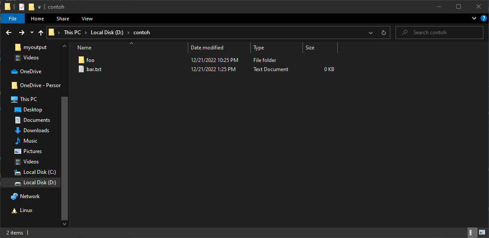
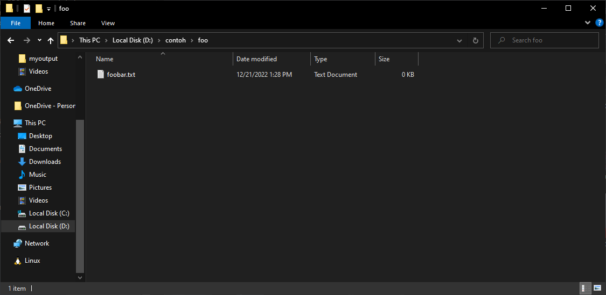

import Quiz from "@site/src/components/quiz";

# Filesystem

Filesystem adalah cara suatu sistem operasi melakukan organisasi dan penyimpanan file di suatu hard drive atau alat penyimpanan lainnya. Konsep ini memberi fondasi untuk sistem operasi dalam menyimpan dan melacak bagaimana suatu file itu disimpan, dan hubungannya dengan file lain.

:::info Catatan untuk pengguna Windows

Untuk memahami secara penuh mengenai konsep filesystem, kamu harus membuat Windows menampilkan _extension_ suatu file. Hal ini dapat dilakukan dengan cara:

1. Buka File Explorer
2. Pada panel di atas, cari tab `View` atau `Tampilan`.
3. Dalam grup `Show/Hide` atau `Pelihatkan/Sembunyikan`, centang kotak `File name extensions` atau `Ekstensi nama file`.  
   

:::

## File

File adalah hal yang biasa kamu temui dalam mengoperasikan suatu komputer. Suatu file dapat menyimpan berbagai macam informasi. Biasanya, suatu file terdiri dari dua bagian, nama file dan juga _extension_-nya. Sebagai contoh, saat kamu membuka suatu dokumen word, kamu berinteraksi dengan suatu file dengan ekstensi `.docx` (atau `.doc`).

Namun, perlu diketahui bahwa nama lengkap suatu file **tidak perlu** terbentuk dari dua bagian itu. Suatu file bisa saja bernama sepert `.env` atau `hello`, dan tersebut tetaplah nama yang valid. Jadi, jangan kaget apabila kamu menemukan suatu file yang terlihat tidak mempunyai "nama" atau _extension_.

Perlu diketahui juga bahwa tidak semua file dapat dibuka dengan cara meng-klik dua kali. Bisa saja suatu file harus dibuka dengan cara khusus sendiri. Oleh karena itu, apabila kamu tidak bisa membuka suatu file dengan klik dua kali, jangan panik! Coba lakukan GSGS terlebih dahulu untuk mencari tahu cara membukanya. Ada kemungkinan juga bahwa file tersebut bukan untuk dibuka juga.

Penggunaan suatu file dapat dilakukan oleh program juga. Sehingga tidak hanya pengguna yang dapat melakukan akses dan mengubah suatu file. Sebagai contoh, suatu game RPG harus melakukan akses pada save file agar pemain bisa menyimpan _progress_ dari permainannya. Kamu akan belajar bagaimana suatu aplikasi dapat mengakses suatu file pada topik Command Line nanti.

## Folder

Folder adahal suatu "kotak" virtual yang digunakan untuk menyimpan file-file yuang berkaitan. Tidak hanya itu, suatu folder bisa menyimpan folder lain, dimana folder tersebut dinamakan _sub-folder_. Pada umumnya, kamu ingin membuat suatu folder memiliki isi yang berkaitan dengan satu sama lain.

Sebagai contoh, kamu mempunyai folder bernama `DDP-1`, di mana dalam folder tersebut memiliki dua folder lagi, yaitu `TP`, dan `Lab`. Untuk masing-masing folder, kamu menyimpan _source code_ dari setiap tugas TP atau Lab kamu. Berikut ilustrasi dari folder tersebut:

```
DDP-1
|
|-- Lab
    |--- lab1.py
    |--- lab2.py
    |--- lab3.py
    |--- lab4.py
    |--- lab5.py
|-- TP
    |--- tp01.py
    |--- tp02.py
    |--- tp03.py
    |--- tp04.py
```

## Path

Setelah mengenal folder dan file, filesystem tentu saja membutuhkan lokasi di mana folder atau file tersebut disimpan. Seperti pada contoh folder `DDP-1` di atas, pada umumnya suatu filesystem menyimpan lokasi seperti suatu "tree", di mana untuk setiap folder atau file mempunyai suatu _parent_ hingga _root_ dari file system tersebut. Perlu diingat bahwa path dapat merepresentasikan folder maupun file.

Sebagai contoh, terdapat suatu file di `C:\Users\User\halo.txt`. Maka:

- Parent dari file tersebut adalah folder `C:\Users\User`
- Root dari file system tersebut adalah `C:\`

Apabila kamu menggunakan Linux/macOS, contoh tersebut dapat berupa `/home/user/halo.txt`. Sehingga:

- Parent dari file tersebut adalah folder `/home/user`
- Root dari file system akan selalu `/`

### Representasi Path

Suatu path memiliki dua cara representasi: _relative_ atau _absolute_. Suatu path yang direpresentasikan secara _absolute_ **pasti** memiliki _root_-nya. Sebagai contoh, `C:\Users\User\halo.txt` untuk Windows dan `/home/user/halo.txt` untuk Linux/macOS. Path yang bersifat _absolute_ pasti memiliki informasi total mengenai arah ke folder/file tersebut.

Suatu path yang bersifat _relative_ hanya memiliki sebagian dari informasi path tersebut. Sebagai contoh, `halo.txt` dan `user/halo.txt` merupakan contoh valid dari _relative path_. Untuk mengakses file tersebut, perlu digabung dengan informasi lain yang diberikan program agar file yang diminta dapat ditemukan. Pada umumnya, _relative path_ biasa digabungkan dengan folder dimana program itu dijalankan. Kamu akan mempelari hal ini lebih lanjut pada topik Command Line.

Sebagai contoh, lihat kondisi folder berikut:



Isi dari folder `folder` adalah sebagai berikut:


Berikut cara merepresentasikan setiap file dan folder yang ada di dalam folder `D:\contoh` (relatif terhadap folder `D:\contoh`, seperti pada explorer):

| Absolute                   | Relative         | Jenis  |
| -------------------------- | ---------------- | ------ |
| D:\contoh                  | .                | Folder |
| D:\contoh\file.txt         | file.txt         | File   |
| D:\contoh\folder           | folder           | Folder |
| D:\contoh\folder\file2.txt | folder/file2.txt | File   |

<Quiz
  answers={[
    "cinta/pacil",
    "pacil",
    "user/saya/cinta/pacil",
    "saya/cinta/pacil",
    "home/user/saya/cinta/pacil",
  ]}
  correctAnswer={3}
>
  Jika terdapat suatu file pada <code>/home/user/saya/cinta/pacil</code>, dan
  kamu berada padda <code>/home/user</code>, apakah <i>relative path</i> file
  tersebut?
</Quiz>
