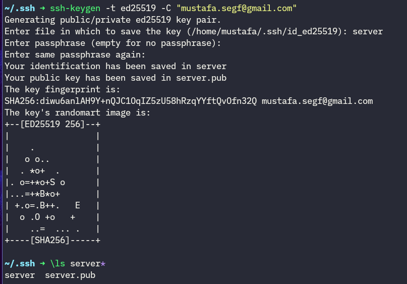
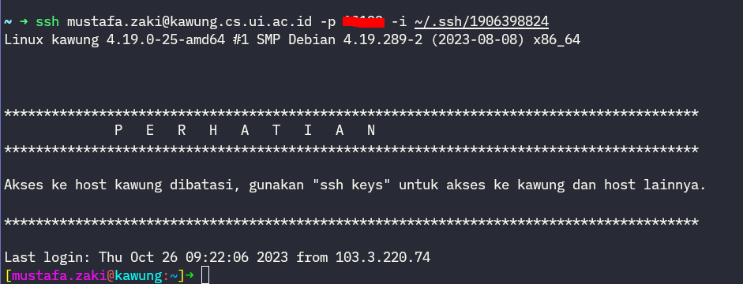
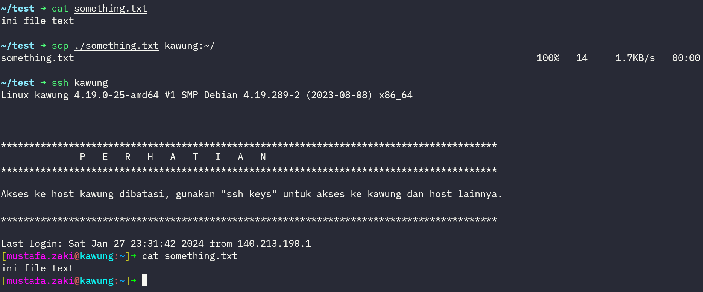

import ArticleInfo from "@site/src/components/ArticleInfo";

<ArticleInfo 
  writer="mustafasegf"
  writerUrl="https://github.com/mustafasegf"
  semester={4}
  relevantSubjects={[
    "Sistem Operasi",
    "Basis Data",
    "Jaringan Komunikasi",
    "Pemrograman Lanjut",
    "Mata kuliah lain yang memerlukan deployment",
  ]}
/>

# SSH
SSH kepanjangan dari Secure Shell adalah protol yang digunakna untuk mengakses komputer lain melalui network secara aman.
SSH dipakai untuk login ke server dengan jaringan yang tidak aman (internet publik).
SSH dipakai untuk mejalankan perintah di server. SSH bisa juga dipakai untuk memindhkan file antara server dan klien.

## Konsep Dasar SSH
SSH bekerja dengan menggunakan pasangan kunci – satu kunci publik dan satu kunci privat. Kunci publik diletakkan pada server, dan siapa pun yang memiliki kunci privat yang sesuai dapat log in ke server tersebut. Ini membantu dalam mengautentikasi pengguna dan menjaga keamanan koneksi

## Kunci SSH
SSH bekerja dengan ada kunci privat dan publik. Kunci public ditaru di server dan privat ada di komputer klien. Kunci privat tidak boleh dibagi, kalau terbagi, orang lain akan bisa mengakses server. Untuk kunci public bisa dibagikan secara bebas.

### Membuat Kunci SSH
1. Buka terminal (cmd, PowerShell, Terminal, atau sejenis).
2. (optional) pergi ke folder `~/.ssh` di linux atau mac. `C:\Users\nama_user\.ssh` di windows.
3. Gunakan perintah berikut untuk membuat kunci SSH (ganti email dengan email kamu):
```bash
ssh-keygen -t ed25519 -C "<email>"
```
4. Masukan lokasi dimana tempat kunci disimpan
5. (optional) Masukan password untuk kunci


## Koneksi SSH
1. Buka terminal
2. Gunakan perintah ssh
```bash
ssh [user]@[host] [-p port] [-i key]
```
Port secara default 22. Gunakan `-p` kalau server menggunakan port selain 22.



## SSH Config
Kalau setiap kali ssh perlu inget username, domain, port, key akan capek mengetik dan menghafalnya.
Untuk mempermudah, kita bisa membuat ssh config sebagai shortcut.

1. Buka folder `~/.ssh` di linux atau max. `C:\Users\nama_user\.ssh` di windows.
2. Buat file `config` tanpa extensi di folder tesebut. Buka file nya kalau sudah ada.
3. Tambahkan konfigurasi ini di file nya.
```config
Host kawung
  Hostname kawung.cs.ui.ac.id
  User mustafa.zaki
  Port 22
  IdentityFile ~/.ssh/1906398824
```
Isi dengan data sesuai yang kalian butuhkan.
4. Untuk mengakses host kawung tersebut, jalankan command
```bash
ssh kawung
```

## SSH Copy (SCP)
SSH bisa digunakan untuk mengcopy file antara server dan klien. Untuk menggopy file bisa menggunakan command `scp`.
```bash
scp [file_sumber] [file_target]
```

kalau ingin mengcopy file dari klien ke server bisa menggunakan
```bash
scp ./something.txt kawung:~/
```


## SSH Tunneling dan Port Forwarding
SSH juga bisa dipakai untuk meng forward port dari local klien kita ke server.
Fungsi ini sangat berguna ketika sedah development dan perlu mengshare hasil di lokal agar bisa diakses orang lain.

Contoh nya di local sedang membuat program di port 3000 dan ingin bisa di akses di server pada port 5000.
```bash
ssh -R 3000:localhost:5000 user@example.com
```

sekarang ketika akses `example.com:5000` akan di forward ke `localhost:3000` pada komputer kita.

## Jump Host
SSH bisa berlapis ketika suatu server cuman bisa diakses dengan jaringan privat ssh.
Contoh di jaringan kawung, ingin mengakses server `dbpg.cs.ui.ac.id`.

```bash
ssh -J kawung mustafa.zaki@dbpg.cs.ui.ac.id
```

jump host ini juga bisa di tulis dalam config untuk mempermudah
```config
Host dbpg
  ProxyJump kawung
  Hostname dbpg.cs.ui.ac.id
  User mustafa.zaki
```

dengan itu bisa langsung akses dbpg dengan
```bash
ssh dbpg
```
